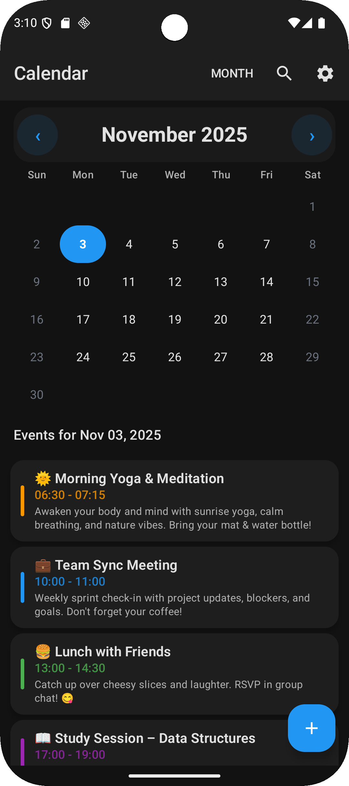
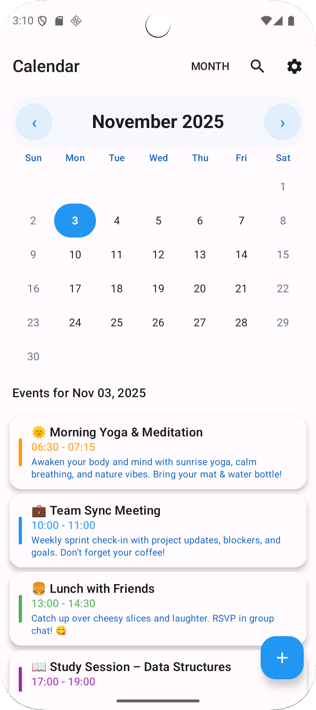
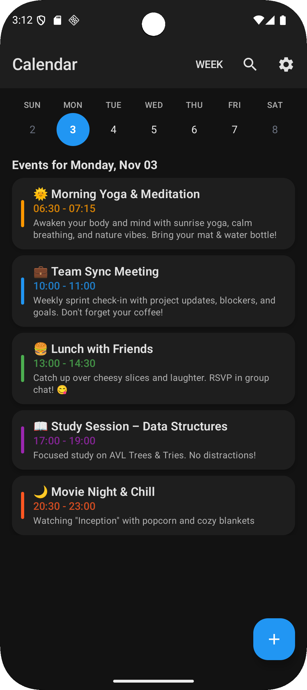
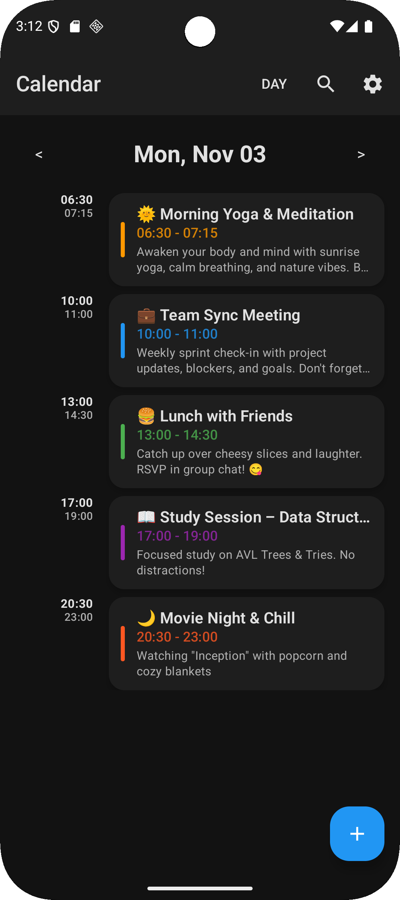

# Modern Calendar App

A modern calendar application built with Kotlin and Jetpack Compose for Android, demonstrating Clean Architecture principles and contemporary Android development practices.

## Features

### Core Functionality
- **Event Management**: Create, edit, and delete events with validation
- **Calendar Views**: Month view with smooth navigation
- **Material 3 Design**: Modern UI with dynamic theming and dark mode support
- **Local Storage**: Room database for offline-first data persistence
- **Search Functionality**: Find events by title, description, or date range

### Coming Soon
- **Authentication**: User login and registration **(Coming Soon)**
- **Week and Day Views**: Additional calendar view modes **(Coming Soon)**
- **Cloud Sync**: Firebase integration for data synchronization **(Coming Soon)**
- **Push Notifications**: Event reminders and alerts **(Coming Soon)**
- **Settings Management**: Customizable preferences **(Coming Soon)**
- **Analytics**: Usage tracking and performance monitoring **(Coming Soon)**
- **Accessibility**: Enhanced accessibility features **(Coming Soon)**

### Technical Features
- **Clean Architecture**: Separation of concerns with MVVM pattern
- **Reactive UI**: StateFlow and Compose for real-time updates
- **Dependency Injection**: Hilt for modular component management
- **Modern UI Components**: Custom calendar components with Material 3

## Screenshots

<div align="center">

### Calendar Views
<table>
  <tr>
    <td align="center">
      
      <br/>
      <b>Dark Mode Calendar</b>
    </td>
    <td align="center">
      
      <br/>
      <b>Light Mode Calendar</b>
    </td>
  </tr>
</table>

### Event Management
<table>
  <tr>
    <td align="center">
      
      <br/>
      <b>Event Details</b>
    </td>
    <td align="center">
      
      <br/>
      <b>Search Events</b>
    </td>
  </tr>
</table>

### Additional Views
<table>
  <tr>
    <td align="center">
      
      <br/>
      <b>Week View</b>
    </td>
    <td align="center">
      
      <br/>
      <b>Day View</b>
    </td>
  </tr>
</table>

</div>

## Architecture

The application follows Clean Architecture principles with MVVM pattern:

```
app/                       # Main application module
├── feature/               # Feature-specific UI and ViewModels
│   ├── calendar/          # Calendar views and navigation
│   ├── events/            # Event creation and editing
│   ├── search/            # Search functionality
│   ├── auth/              # Authentication (Coming Soon)
│   └── settings/          # Application settings (Coming Soon)
├── di/                    # Dependency injection modules
├── navigation/            # Navigation configuration
└── data/                  # Mock data services for development

core/                      # Shared core modules
├── common/                # Common utilities and models
├── data/                  # Data layer with Room and repositories
├── ui/                    # Shared UI components and theming
├── auth/                  # Authentication module (Coming Soon)
├── sync/                  # Cloud synchronization (Coming Soon)
├── analytics/             # Analytics integration (Coming Soon)
├── accessibility/         # Accessibility features (Coming Soon)
├── performance/           # Performance monitoring (Coming Soon)
├── reminders/             # Notification system (Coming Soon)
└── settings/              # Settings management (Coming Soon)
```

## Technology Stack

- **Language**: Kotlin 2.0.20
- **UI Framework**: Jetpack Compose with Material 3
- **Architecture**: MVVM with Clean Architecture
- **Dependency Injection**: Hilt
- **Database**: Room with SQLite
- **Build System**: Gradle with Kotlin DSL
- **Testing**: JUnit, MockK (Coming Soon)
- **Firebase**: Authentication, Firestore, Analytics (Coming Soon)
- **Performance**: Firebase Performance Monitoring (Coming Soon)

## Build Requirements

- Android Studio Hedgehog (2023.1.1) or later
- JDK 17 or later
- Android SDK API 26 (minimum) / API 34 (target)
- Kotlin 2.0.20

## Getting Started

### Installation

1. Clone the repository:
   ```bash
   git clone https://github.com/HRG-OFFICIAL/Android-Calendar.git
   cd Android-Calendar
   ```

2. Open the project in Android Studio:
   - Launch Android Studio
   - Select "Open an existing project"
   - Navigate to the cloned directory
   - Wait for Gradle sync to complete

3. Build and run:
   - Connect an Android device or start an emulator (API 26+)
   - Click "Run" or use `Ctrl+R` (Windows/Linux) / `Cmd+R` (macOS)

### Development Setup

The app uses mock data for development and testing. No additional configuration is required for basic functionality. Firebase integration and authentication features are planned for future releases.

## Usage

### Basic Operations

- **View Calendar**: Navigate through months using the calendar interface
- **Create Events**: Tap the floating action button (+) to create new events
- **Edit Events**: Tap on any event to view details and edit
- **Search Events**: Use the search functionality to find specific events
- **Theme Toggle**: Switch between light and dark themes

### Current Limitations

This is a development version with mock data. User authentication, cloud sync, and advanced features are planned for future releases.

## Testing

Build the project:
```bash
./gradlew build
```

Run unit tests (Coming Soon):
```bash
./gradlew test
```

Run instrumented tests (Coming Soon):
```bash
./gradlew connectedAndroidTest
```

## Project Structure

The project demonstrates several Android development best practices:

- **Modular Architecture**: Separation between app and core modules
- **Clean Architecture**: Clear separation of concerns across layers
- **MVVM Pattern**: ViewModels manage UI state and business logic
- **Dependency Injection**: Hilt provides dependencies across modules
- **Reactive Programming**: StateFlow for reactive UI updates
- **Material Design**: Modern UI following Material 3 guidelines

## Development Status

This project is currently in active development. The core calendar functionality is implemented with mock data for demonstration purposes. Several advanced features are planned for future releases and are marked as "Coming Soon" throughout the documentation.

## License

This project is licensed under the MIT License - see the [LICENSE](LICENSE) file for details.